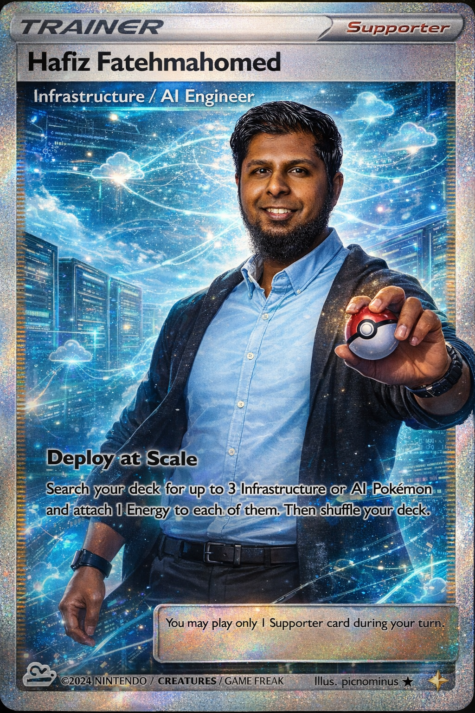

# Hi there, I'm Hafiz Fatehmahomed! 👋

  
  
  
  

---
## About Me 🚀

I'm an **Infrastructure Engineer** with a strong focus on **Microsoft Azure**, **Infrastructure as Code (IaC)**, **cloud security**, and **AI engineering**.

I design and deliver **enterprise-scale cloud platforms**, leading **Azure Public Cloud migrations** and building secure, scalable, and resilient environments aligned with the **Azure Landing Zone Architecture**. My work centers on creating repeatable, policy-driven infrastructure using **Bicep IaC**, supporting complex and hybrid workloads across cloud and on-prem environments.

I actively integrate **AI-assisted engineering workflows** into my day-to-day work to improve architecture design, automation, and delivery efficiency. By leveraging tools such as **GitHub Copilot**, **Claude Code**, and **Spec Kit**, I accelerate infrastructure development, enhance code quality, and make better-informed architectural decisions.

- ☁️ **Platforms:** Microsoft Azure, Hybrid & On-Prem
- 🛠 **Infrastructure as Code:** Bicep, Terraform
- 🔐 **Focus Areas:** Cloud Security, Zero Trust, Identity, Landing Zones
- 📜 **Languages & Automation:** PowerShell, Python, React
- 🤖 **AI Tooling:** GitHub Copilot, Claude Code, Spec Kit, Microsoft Foundry, Copilot Studio

---

## My Skills 🧠

### Cloud & Infrastructure

### Automation & Scripting

### AI & Developer Tooling

---

## Certifications 🏆

### 🔐 Security

### ☁️ Azure

### 🤖 Fundamentals

📜 **View all credentials:**  
👉 https://learn.microsoft.com/en-us/users/hafizurrahman-0048/credentials/certifications?tab=credentials-tab
👉 https://www.credly.com/users/hafizurrahman-fatehmahomed/badges#credly

---

## My Github Pages
👉 https://hafizurrahman-fatehmahomed.github.io/github-copilot-enterprise/
👉 https://hafizurrahman-fatehmahomed.github.io/hip-book/

---
## Get in Touch 📬

- 💼 **LinkedIn:** https://www.linkedin.com/in/hafiz-fatehmahomed-0089a6115/
- 💻 **GitHub:** https://github.com/Hafizurrahman-Fatehmahomed/Hafizurrahman-Fatehmahomed
- 🎓 **Microsoft Learn:** https://learn.microsoft.com/en-us/users/hafizurrahman-0048/credentials/certifications?tab=credentials-tab

